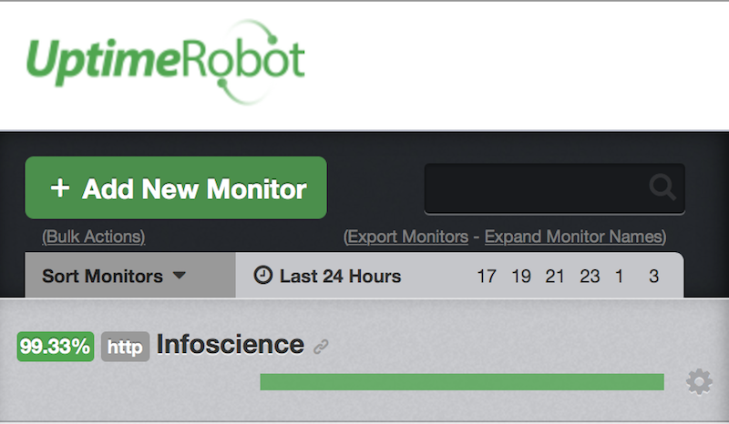
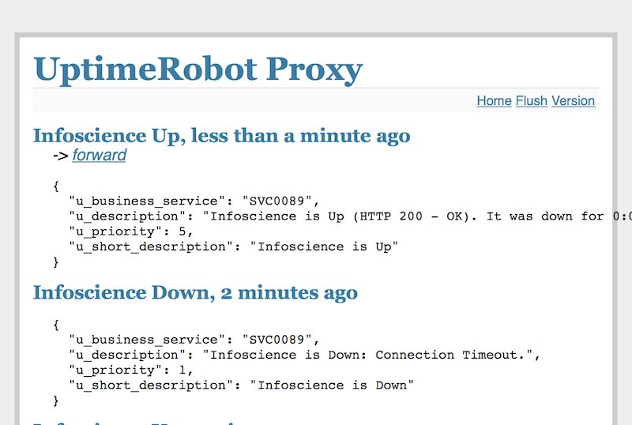
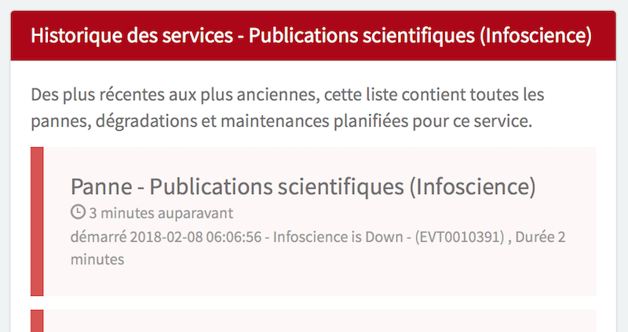

<!-- markdownlint-disable -->
<h1 align="center" style="margin:1em">
  
  
Uptime Proxy

</h1>

<h4 align="center">
  Forward your UptimeRobots alerts where you want, in the format you choose
</h4>

  
  
  
  

 

## Overview

UptimeRobot | Uptime Proxy | E2E Monitoring
---------|----------|---------
 |  | 
[UptimeRobot.com](https://uptimerobot.com) will monitor your site (it is free up to 50 monitors) and it will trigger alerts, either to email contacts or custom [web hooks](https://blog.uptimerobot.com/web-hook-alert-contacts-new-feature/). The configuration is somehow limited, hence the need for a proxy... | [Uptime proxy](https://github.com/ebreton/uptimerobot-proxy) will expose a web hook to receive the data from UptimeRobot, reformat it according to your needs, and post the result to your prefered web service | In our example, [EPFL E2E Monitoring](https://it.epfl.ch/help/?id=epfl_services_status) solution will be our web service. The access is restricted, the format [constrained]( https://it.epfl.ch/help/?id=epfl_kb_article_view&sys_kb_id=b318ffa34fda8b44ac260ebf0310c7e6): it cannot accept raw data from UptimeRobot...
 
### Main features

- **Out-of-the-box** support for EPFL E2E Monitoring
- **Comes with a basic frontend** that displays a list of the proxied event, and let you replay them (limited to 'UP' notifications in code)
- **Support for DB (but not mandatory)** if persistent storage is needed: will use postgreSQL with Heroku by default. Also works without DB, in which case the events will be stored in memory, until next restart of the application
- **Configuration through environement variables** in a `.env` file: mainly for Heroku, storage type, E2E Monitoring. One given `.env` will setup a proxy instance for one given service
- **Dev friendly**: A Makefile will allow to quickly setup the dev environment. The application can be run locally with hot reloading of the code, or without. With DB or without. Emulating Heroku context or not. `make deploy` will push the app online.
- **Automated** testing and deployment: connected to Travis and Codecov, relies on Heroku toolbelt for deployment.

### Something is missing ?

Head to [githup issues](https://github.com/ebreton/uptimerobot-proxy/issues) and submit one ! Be sure to have a look at the [CONTRIBUTING.md](./docs/CONTRIBUTING.md) guide before

## Install and Usage

Check out [INSTALL.md](./docs/INSTALL.md) for more details

## Changelog

All notable changes to this project are documented in [CHANGELOG.md](./docs/CHANGELOG.md).

## Contribution

Check out [CONTRIBUTING.md](./docs/CONTRIBUTING.md) for more details

As well as our [CODE_OF_CONDUCT.md](./docs/CODE_OF_CONDUCT.md), where we pledge to making participation in our project and our community a harassment-free experience for everyone
