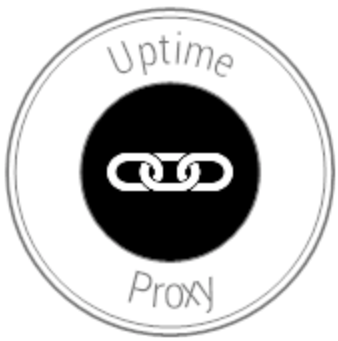

<!-- markdownlint-disable -->
<h1 align="center" style="margin:1em">
  
  
Uptime Proxy

</h1>

<h4 align="center">
  Forward your UptimeRobots alerts where you want, in the format you choose
</h4>

  
  
  
  

 

## Overview

coming ...

## Install and Usage

coming ...

## Changelog

All notable changes to this project are documented in [CHANGELOG.md](./docs/CHANGELOG.md).

## Contribution

Check out [CONTRIBUTING.md](./docs/CONTRIBUTING.md) for more details

As well as our [CODE_OF_CONDUCT.md](./docs/CODE_OF_CONDUCT.md), where we pledge to making participation in our project and our community a harassment-free experience for everyone
